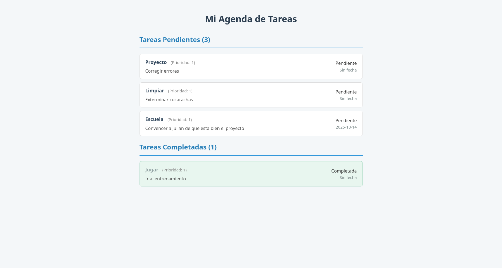

# ProyectosModeladoBZJRRJH
Repositorio donde se realizaran los distintos proyectos de la materia de Modelado y programacion del tercer semestre de la carrear de ciencias de la computacion UNAM del equipio formado por: Belmont Zuniga Javier y Reyes Rios Julian Humberto

# Proyecto 2: Agenda con Salida en HTML

Este proyecto es una escalacion del proyecto anterior, para permitir la visualizacion con uso de html y css.

## Descripción

El sistema permite gestionar una lista de tareas que se almacena en un archivo `tareas.json`. A través de un script de Python, se genera un reporte visual en formato HTML para una fácil visualización en cualquier navegador web.

## Cómo Ejecutar el Proyecto

1.  **Añadir o modificar tareas (Opcional)**: Para modificar algo en la lista de tareas, se hace como en la entrega del prouecto 1, es decir desde la terminal como se ve en ./Instrucciones.txt

2.  **Generar el reporte HTML**: Para generar o actualizar el archivo `index.html`, ejecuta el siguiente comando en tu terminal desde la carpeta `root/`:
    ```bash
    python export_html.py
    ```

3.  **Ver el resultado**: Abre el archivo `index.html` en tu navegador web. Puedes hacer doble clic sobre él o arrastrarlo a una ventana del navegador.

## Captura de Pantalla del Resultado
Captura de la pagina web

